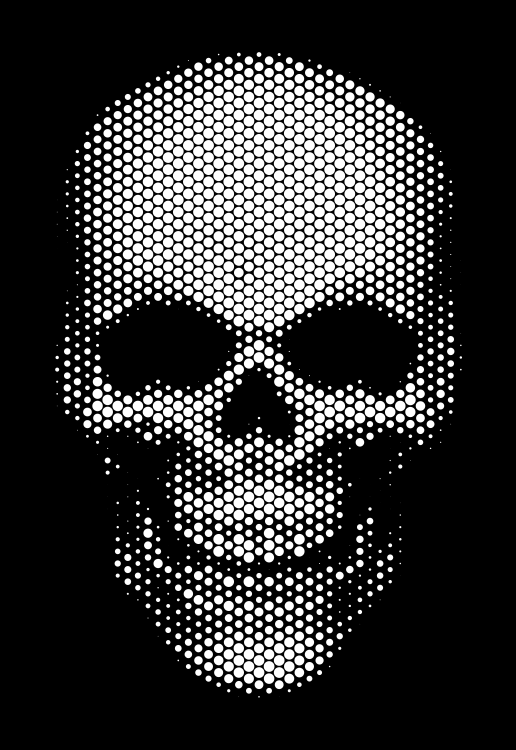

# Python Hex-grid Halftoner
I couldn't find Python halftoner that worked on a hexagonal grid pattern (there are several that work on an orthogonal grid), so I wrote my own.

The code uses [https://opencv.org/](OpenCV) to do the heavy lifting. I used https://hub.docker.com/r/yoanlin/opencv-python3

<pre>
usage: app.py [-h] -i INPUT -o OUTPUT [-r RADIUS] [-t THRESHOLD]

optional arguments:
  -h, --help            show this help message and exit
  -i INPUT, --input INPUT
                        path to the input image
  -o OUTPUT, --output OUTPUT
                        path to the output image (PNG, JPG or SVG)
  -r RADIUS, --radius RADIUS
                        grid radius, in pixels (default 10)
  -t THRESHOLD, --threshold THRESHOLD
                        dots smaller than this are not drawn in output
                        (default 0)

e.g.: $> python3 halftoner.py -i skull.jpg -o skull.svg -r 10 -t 2
</pre>

For more information, see https://chrismolloy.com/halftoner

